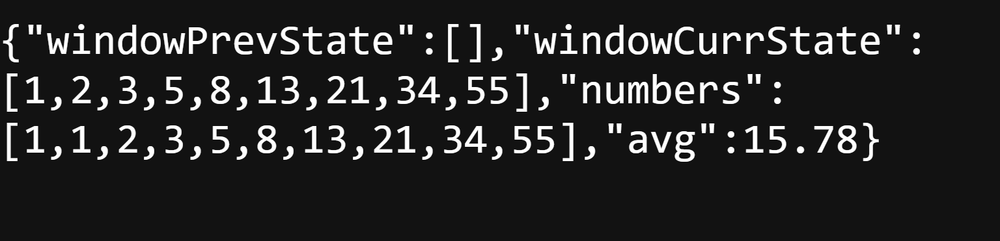
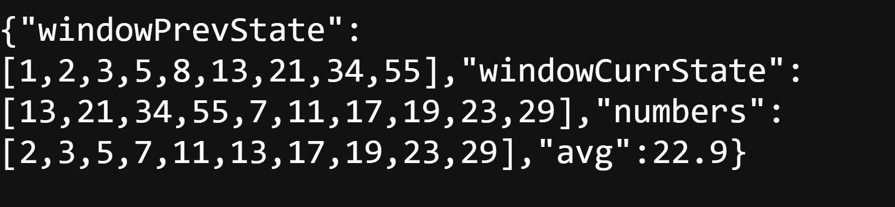
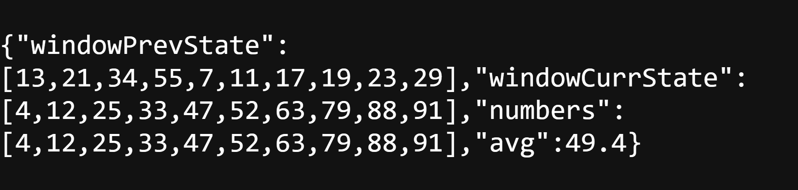
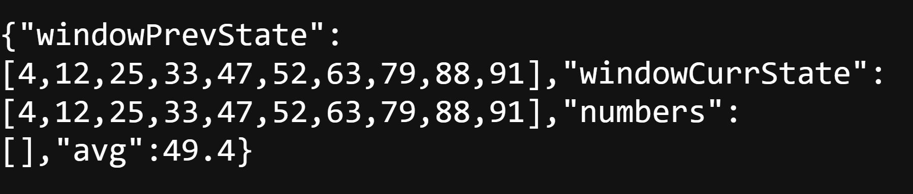

Average Calculator Microservice
Overview
This is an Average Calculator HTTP Microservice that exposes a REST API to fetch and process numbers from a third-party service. It supports fetching numbers from different categories:
•	Prime Numbers (p)
•	Fibonacci Numbers (f)
•	Even Numbers (e)
•	Random Numbers (r)
The microservice maintains a fixed-size sliding window of numbers and calculates the average of the latest valid entries.
Features
•	Fetches numbers dynamically from a third-party API.
•	Ensures only unique numbers are stored.
•	Ignores slow responses (>500ms) or failed API calls.
•	Maintains only the latest window size count of numbers.
•	Provides a JSON response with previous and current window states along with the calculated average.
API Endpoints
1. Fetching Numbers
GET /numbers/{numberid}
Example:
http://localhost:9876/numbers/e
Response:
{
  "windowPrevState": [],
  "windowCurrState": [2, 4, 6, 8],
  "numbers": [2, 4, 6, 8],
  "avg": 5.00
}
Setup and Installation
Prerequisites
•	Node.js installed on your system.
Steps to Run the Project
1.	Clone the repository:
git clone https://github.com/Mithra-28/717822Y130.git
cd 717822Y130/Question2
2.	Install dependencies:
npm install
3.	Start the server:
node server.js
4.	Test the API: Open your browser or use Postman:
http://localhost:9876/numbers/p
Folder Structure
717822Y130/
  ├── Question1/  # Placeholder for another submission
  ├── Question2/
  │   ├── server.js
  │   ├── package.json
  │   ├── package-lock.json
  │   ├── README.md
Deployment
To deploy the project:
1.	Zip the project folder and share it with your team.
2.	Upload the project to GitHub:
git init
git add .
git commit -m "Initial commit"
git branch -M main
git remote add origin https://github.com/Mithra-28/717822Y130.git
git push -u origin main
Screenshots of this project:\
http://localhost:9876/numbers/f

 
http://localhost:9876/numbers/p

 
http://localhost:9876/numbers/r

 
http://localhost:9876/numbers/e

 

Notes
•	Ensure to use your own repository name instead of 717822Y130.
•	Regular commits are recommended to track progress.
•	Follow production-grade coding practices with proper comments and structure.
License
This project is licensed under the MIT License.

